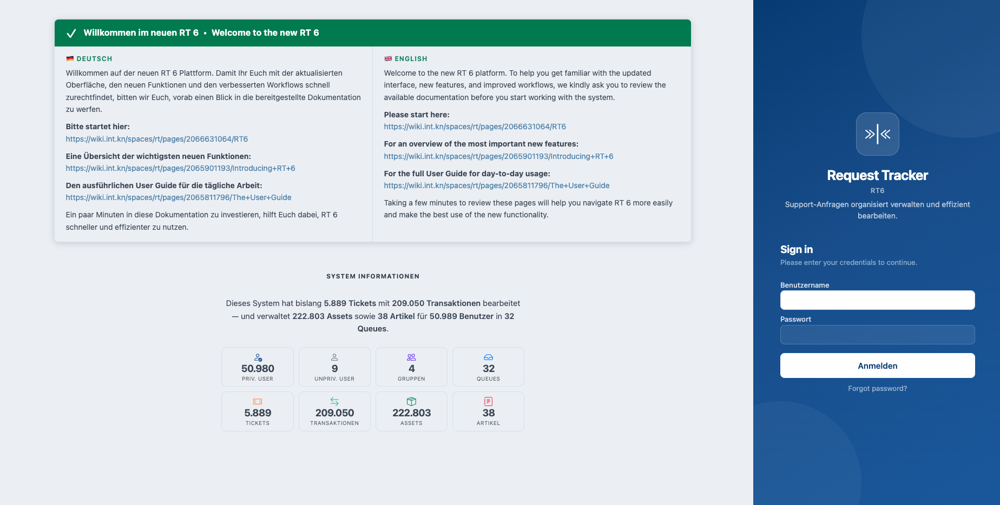

# RT-Extension-Redesign

Modern UI redesign for Request Tracker 6 — a complete CSS overhaul, modernised page templates, and a growing collection of integrated extensions for dashboard widgets, ticket-page widgets, and UI enhancements.



---

## Contents

- [Features](#features)
  - [Global Styling](#global-styling)
  - [Page Templates](#page-templates)
  - [Ticket Page Widgets](#ticket-page-widgets)
  - [Dashboard Widgets](#dashboard-widgets)
  - [Syntax Highlighting](#syntax-highlighting)
- [Configuration](#configuration)
- [Installation](#installation)
- [Absorbed Extensions](#absorbed-extensions)
- [Requirements](#requirements)
- [Author / License](#author--license)

---

## Features

### Global Styling

Overlays RT6 with a modern CSS overhaul based on Bootstrap 5.3 and Bootstrap Icons:

- **TitleBox:** rounded corners, subtle shadows, coloured top border per widget type
- **Tables:** compact headers, filter buttons, priority badges (green/yellow/red), SLA badges
- **Ticket list:** priority and SLA as coloured badges, due-date badges, status badges
- **Ticket detail:** section icons (Bootstrap Icons), uppercase field labels, coloured left border per history type
- **Dashboard:** portlet icons, result banners, compact portlet headers
- **Reply/Comment:** blue/orange left border for visual distinction
- **Dark mode:** fully supported via `var(--bs-*)` CSS variables and `[data-bs-theme=dark]` selectors

### Page Templates

Overridden RT pages with a modern layout:

| Page | What changes |
|---|---|
| **Login** (`/`) | Two-column layout — left: plugin content + live system stats; right: login form |
| **Admin** (`/Admin/`) | Stat cards, info cards, nav tiles replacing the bestpractical.com iframe |
| **Admin → Global** | Scrips/templates dashboard with counters |
| **Admin → Articles/Assets/Tools/CustomFields** | Overview dashboards with cards |
| **Admin → Global → Login Banner** | Edit page for the login banner |
| **Reports** (`/Reports/`) | Card grid with report tiles |
| **Tools** (`/Tools/`) | Stat cards and nav tiles |
| **Simple Search** (`/Search/Simple.html`) | Hero search with keyword cards |

The **system statistics** on the login page show: privileged/unprivileged users, groups, queues, tickets, transactions, assets, and articles — cached via `rt-redesign-stats-refresh`. The login page and every admin dashboard show a "last update" timestamp so it is clear how current the figures are. The login page renders it in the RT server timezone (`$Timezone`, normally UTC); the admin dashboards render it in the logged-in user's own timezone preference. The login page is public, so until the refresh script has run it shows a neutral "statistics currently unavailable" note rather than computing the figures live on every visitor request (the run-the-script hint stays on the SuperUser-only admin dashboards).

### Ticket Page Widgets

These widgets can be added to ticket page columns via **Admin → Global → Page Layouts**.

#### DisplaySLA

Shows the SLA level and both deadlines (Time to React + Time to Resolve) colour-coded by urgency:

- **Green** → sufficient time remaining
- **Yellow** → less than 25 % of total time remaining
- **Red** → deadline exceeded
- **Paused indicator** → when the ticket is in an ignored status

The widget hides itself automatically when no SLA is configured for the ticket's queue.

#### LifecycleWidget

Renders the ticket queue's lifecycle as an interactive SVG diagram:

- Status nodes colour-coded by type (Initial / Active / Inactive)
- Current ticket status highlighted
- Transition arrows between statuses
- Adaptive layout — resizes responsively with the widget column width
- For complex lifecycles (> 20 statuses): shows only transitions from/to the current status

#### LinkedArticles

Displays all articles linked to the current ticket as compact cards:

- Article name as a link, class as a badge
- Summary shown when available
- Refreshes automatically via HTMX when links change
- Hides itself when no articles are linked

#### Requestor Assets

Adds an **Assigned Assets** block to the "More about the requestors" box on the ticket
display page (via a callback — no Page Layout needed). For each requestor it lists the
assets they are linked to as **HeldBy**, **Contact**, or **Owner**:

- Asset ID and name link to the asset display page, plus its description
- Hides itself when the requestor has no assets

**Note:** This block only appears for requestors that RT renders in the "More about the
requestors" box. By default RT shows that box for **unprivileged** requestors only. Since
asset holders are typically privileged users, set `$ShowMoreAboutPrivilegedUsers` to `1`
in `RT_SiteConfig.pm` if you want the asset block to appear for privileged requestors (see
[Configuration](#configuration)).

### Dashboard Widgets

These widgets can be added as portlets to the RT dashboard. The portlet name for `$HomepageComponents` is shown in parentheses.

#### ClockWidget (`ClockWidget`)

Animated Apple-style flip clock — shows hours and minutes plus the current date in the browser's local time zone.

#### WeatherWidget (`WeatherWidget`)

Live weather data based on the user profile location:

- Reads **City**, **Zip**, and **Country** from the RT user profile
- Geocoding via Open-Meteo + Nominatim (no API key required)
- Displays: temperature, condition, feels-like, wind speed, humidity
- Session cache (30 minutes), retry button, dark-mode support
- Configurable temperature unit (`celsius` / `fahrenheit`)

If no location is stored in the profile, a link to the preferences page is shown instead.

#### FeedWidget (`FeedWidget`)

Tabbed RSS/ATOM feed reader — fully configurable per user:

- Feeds are configured in **Prefs → About Me** (URL, label, max items)
- One tab per feed showing title, date, and summary for each entry
- Feed fetching is server-side (no browser CORS issues)
- Session cache (15 minutes), refresh button
- Requires a CSRF whitelist entry (see [Configuration](#configuration))
- SSRF guard: only `http`/`https` feeds are accepted, and feeds whose host
  resolves into a private, loopback or link-local range are refused (the
  server-side fetch cannot be used to probe the internal network)

#### UserProfileWidget (`UserProfileWidget`)

Profile card for the currently logged-in user:

- Avatar (from RT profile), name, organisation
- Email, work phone, mobile phone, postal address
- Link to **Prefs → About Me** for quick editing

#### ArticlesWidget (`ArticlesWidget`)

Shows the 5 newest articles across all accessible classes as compact cards — with name, class, summary, author, and age.

#### AssetsWidget (`AssetsWidget`)

Shows the 5 most recently updated assets as compact cards — with ID, name, catalogue, status, held-by, and last-updated.

### Syntax Highlighting

Adds syntax highlighting to CKEditor code blocks in ticket descriptions and replies:

- Library: [highlight.js](https://highlightjs.org/) (default: v11.10.0 via CDN)
- Syncs with RT's dark/light mode toggle
- Supported languages: Perl, JavaScript, Python, Bash, SQL, YAML, JSON, XML/HTML, Plain Text
- Language list in the CKEditor toolbar is configurable (see [Configuration](#configuration))

---

## Configuration

### FeedWidget — CSRF whitelist

FeedWidget uses internal helper endpoints that must be whitelisted in `RT_SiteConfig.pm`:

```perl
Set(%ReferrerComponents,
    "/FeedWidget/Fetch.html"     => 1,
    "/FeedWidget/SaveFeeds.html" => 1,
);
```

### Login page — "Why Request Tracker?" promo grid

When no maintenance banner is active, the login page can show a promotional grid
of RT selling points. It is **off by default**. Enable it with:

```perl
Set($LoginShowPromo, 1);
```

This option is also listed (read-only) under **Admin → Tools → System Configuration**;
change the value in `RT_SiteConfig.pm` as above.

### WeatherWidget — temperature unit

```perl
Set(%WeatherWidgetOptions,
    TemperatureUnit => 'celsius',   # or 'fahrenheit'
);
```

### DisplaySLA — level colours

Optional colour overrides for SLA level badges (sensible defaults are built in):

```perl
Set(%DisplaySLAOptions,
    LevelColors => {
        critical => '#dc3545',
        high     => '#fd7e14',
        normal   => '#0d6efd',
        low      => '#198754',
    },
);
```

### Syntax highlighting — CDN URLs

```perl
# highlight.js CDN (set to '' to disable)
Set($SyntaxHighlightJS,
    'https://cdnjs.cloudflare.com/ajax/libs/highlight.js/11.10.0/highlight.min.js');

# Light-mode theme
Set($SyntaxHighlightCSS,
    'https://cdnjs.cloudflare.com/ajax/libs/highlight.js/11.10.0/styles/github.min.css');

# Dark-mode theme
Set($SyntaxHighlightCSSdark,
    'https://cdnjs.cloudflare.com/ajax/libs/highlight.js/11.10.0/styles/github-dark.min.css');
```

### CKEditor code block language list

```perl
Set(%MessageBoxRichTextInitArguments,
    codeBlock => {
        languages => [
            { language => 'plaintext',   label => 'Plain text'  },
            { language => 'perl',        label => 'Perl'        },
            { language => 'javascript',  label => 'JavaScript'  },
            { language => 'python',      label => 'Python'      },
            { language => 'bash',        label => 'Bash/Shell'  },
            { language => 'sql',         label => 'SQL'         },
            { language => 'yaml',        label => 'YAML'        },
            { language => 'json',        label => 'JSON'        },
            { language => 'xml',         label => 'XML/HTML'    },
        ],
    },
);
```

### Dashboard widgets — HomepageComponents

Add the portlet names to `$HomepageComponents` to make them available in the dashboard editor:

```perl
Set($HomepageComponents, [qw(
    QuickCreate Quicksearch MyAdminQueues MySupportQueues
    RefreshHomepage Dashboards SavedSearches
    ClockWidget
    WeatherWidget
    ArticlesWidget
    AssetsWidget
    UserProfileWidget
    FeedWidget
)]);
```

### Requestor Assets — show for privileged requestors

The **Assigned Assets** block in the "More about the requestors" box only renders for
requestors that RT lists there. RT hides privileged requestors from that box by default,
so asset holders (usually privileged users) will not show up unless you enable:

```perl
Set($ShowMoreAboutPrivilegedUsers, 1);
```

This is a core RT option; it also affects the comments, ticket-list, and groups sections
of the same box.

### Ticket page widgets — Page Layout

The following widgets appear in **Admin → Global → Page Layouts** and can be dragged into ticket columns:

- `DisplaySLA` — SLA deadlines widget
- `LifecycleWidget` — lifecycle state diagram
- `LinkedArticles` — linked articles list

---

## Installation

```bash
perl Makefile.PL
make
sudo make install
```

Register the plugin in `RT_SiteConfig.pm`:

```perl
Plugin('RT::Extension::Redesign');
```

Clear the Mason cache and restart Apache:

```bash
sudo systemctl stop apache2
sudo rm -rf /opt/rt6/var/mason_data/obj/*
sudo systemctl start apache2
```

---

## Absorbed Extensions

As of v0.09, the following formerly standalone extensions have been fully absorbed into Redesign and **no longer need** to be installed or listed in `RT_SiteConfig.pm` separately:

| Extension | Since | What it provides |
|---|---|---|
| RT-Extension-AdminDashboard | v0.07 | Admin page dashboard, system statistics, login banner |
| RT-Extension-SyntaxHighlight | v0.09 | highlight.js for CKEditor code blocks |
| RT-Extension-DisplaySLA | v0.09 | SLA deadlines widget on ticket pages |
| RT-Extension-LifecycleWidget | v0.09 | Lifecycle SVG diagram on ticket pages |
| RT-Extension-LinkedArticles | v0.09 | Linked articles widget on ticket pages |
| RT-Extension-ClockWidget | v0.09 | Flip clock dashboard portlet |
| RT-Extension-WeatherWidget | v0.09 | Live weather dashboard portlet |
| RT-Extension-FeedWidget | v0.09 | RSS/ATOM feed reader dashboard portlet |
| RT-Extension-UserProfileWidget | v0.09 | User profile dashboard portlet |
| RT-Extension-ArticlesWidget | v0.09 | Newest articles dashboard portlet |
| RT-Extension-AssetsWidget | v0.09 | Recently updated assets dashboard portlet |

### Migrating from standalone installations

If one or more of these extensions are already installed:

1. Install this extension (`perl Makefile.PL && make && sudo make install`).
2. Remove `Plugin('RT::Extension::XXX');` for each of the above from `RT_SiteConfig.pm`.
3. For `RT-Extension-AdminDashboard`: update any cron entry from `rt-admin-dashboard-refresh` to `rt-redesign-stats-refresh` — the attribute name (`AdminDashboardStats`) and all behaviour remain identical.
4. For `RT-Extension-FeedWidget`: add the CSRF whitelist (see [Configuration](#configuration)).
5. Clear the Mason cache and restart Apache.

---

## Requirements

- Request Tracker 5.0 or later
- RT 7.0 is not supported

## Author / License

Torsten Brumm — GNU General Public License v2
